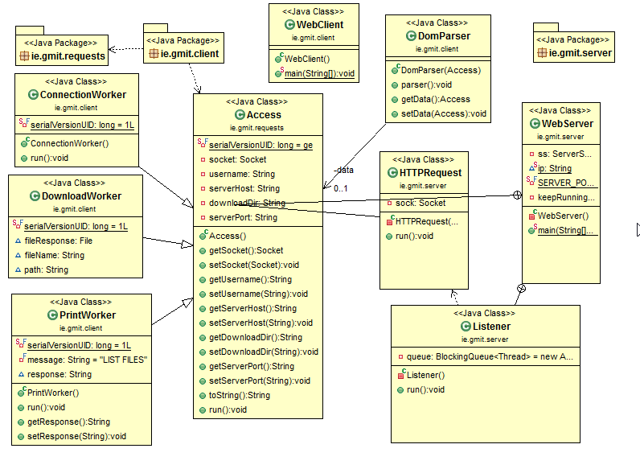

# File-Server

---
The following is a file server which uses threads to allow a client to interact with a server, when WebClient is executed the user is presented with:

1. Connect to server(or disconnect from server)
2. Print file listing
3. Download file
4. Quit

JavaDocs can viewed in a browser explaining each class, all requests that pass through the server are logged in a text file on ther server-side.

